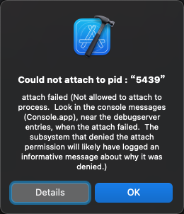

# 任意进程可调试

iOS逆向期间：

* 想要实现：任意进程可调试
  * 否则，Xcode去调试，就会报错：
    ```bash
    Could not attach to pid : xxx

    attach failed (Not allowed to attach to process.  Look in the console messages (Console.app), near the debugserver entries, when the attach failed.  The subsystem that denied the attach permission will likely have logged an informative message about why it was denied.)
    ```
    * 
* 手段
  * 直接用`XinaA15`越狱（如果是A12+的iPhone的话）
    * 注：XinaA15自带支持所有进程可调试
  * 自己手动去操作：去给单个二进制文件**重新签名**，加可调试权限
      * 核心思路：导出原有entitlement权限，加上新的可调试权限（和其他权限微调），再用codesign去重签名，再写回iPhone
