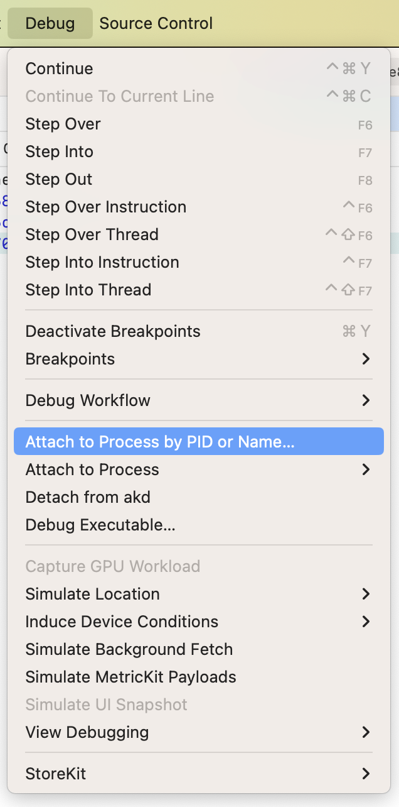
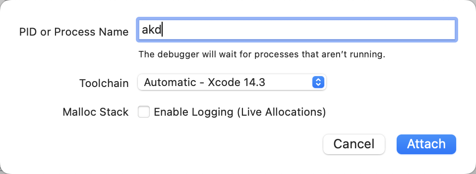
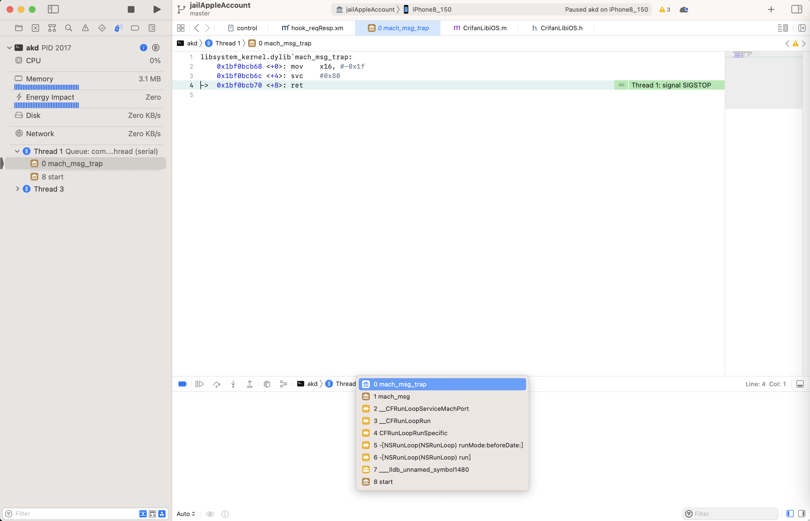

# 手动给单个二进制文件重签名

后来发现另外方式也暂时可以实现：任意进程可调试

对于要调试的文件：

* 服务进程=二进制文件
  * 比如
    * `AuthKit`的daemon服务进程的二进制文件：`akd`
* app内的核心二进制文件
  * 比如
    * iOS系统内置app：`设置`=`Preferences`的 `Preferences.app/Preferences`

## 举例

### akd

* （1）从越狱iPhone中导出原始的`akd`
  ```bash
  scp root@192.168.1.22:/System/Library/PrivateFrameworks/AuthKit.framework/akd akd_origin
  ```
* （2）导出`akd`中原始的entitlement权限
  ```bash
  ldid -e akd
  ```

此处输出内容是：

```xml
<?xml version="1.0" encoding="UTF-8"?>
<!DOCTYPE plist PUBLIC "-//Apple//DTD PLIST 1.0//EN" "http://www.apple.com/DTDs/PropertyList-1.0.dtd">
<plist version="1.0">
<dict>
    <key>abs-client</key>
    <string>143531244</string>
    <key>adi-client</key>
    <string>572356293</string>
    <key>application-identifier</key>
    <string>com.apple.akd</string>
    <key>aps-connection-initiate</key>
    <true/>
    <key>com.apple.CommCenter.fine-grained</key>
    <array>
        <string>spi</string>
        <string>identity</string>
    </array>
    <key>com.apple.CompanionLink</key>
    <true/>
    <key>com.apple.accounts.idms.fullaccess</key>
    <true/>
    <key>com.apple.appletv.pbs.user-presentation-service-access</key>
    <true/>
    <key>com.apple.authkit.client.internal</key>
    <true/>
    <key>com.apple.cdp.walrus</key>
    <true/>
    <key>com.apple.coreidvd.spi</key>
    <true/>
    <key>com.apple.keystore.lockassertion</key>
    <true/>
    <key>com.apple.keystore.sik.access</key>
    <true/>
    <key>com.apple.mobileactivationd.device-identifiers</key>
    <true/>
    <key>com.apple.mobileactivationd.spi</key>
    <true/>
    <key>com.apple.nano.nanoregistry</key>
    <true/>
    <key>com.apple.private.MobileActivation</key>
    <array>
        <string>RequestActivationState</string>
    </array>
    <key>com.apple.private.accounts.allaccounts</key>
    <true/>
    <key>com.apple.private.adid</key>
    <true/>
    <key>com.apple.private.applemediaservices</key>
    <true/>
    <key>com.apple.private.aps-connection-initiate</key>
    <true/>
    <key>com.apple.private.associated-domains</key>
    <true/>
    <key>com.apple.private.followup</key>
    <true/>
    <key>com.apple.private.ids.messaging</key>
    <array>
        <string>com.apple.private.alloy.anisette</string>
    </array>
    <key>com.apple.private.ids.phone-number-authentication</key>
    <true/>
    <key>com.apple.private.ids.remotecredentials</key>
    <true/>
    <key>com.apple.private.imcore.imremoteurlconnection</key>
    <true/>
    <key>com.apple.private.keychain.circle.join</key>
    <true/>
    <key>com.apple.private.notificationcenter-system</key>
    <array>
        <dict>
            <key>identifier</key>
            <string>com.apple.AuthKit</string>
        </dict>
    </array>
    <key>com.apple.private.octagon</key>
    <true/>
    <key>com.apple.private.security.storage.Safari</key>
    <true/>
    <key>com.apple.private.storagekitd.info</key>
    <true/>
    <key>com.apple.private.usernotifications.bundle-identifiers</key>
    <array>
        <string>com.apple.Preferences</string>
    </array>
    <key>com.apple.security.attestation.access</key>
    <true/>
    <key>com.apple.security.exception.mach-lookup.global-name</key>
    <array>
        <string>com.apple.SharedWebCredentials</string>
        <string>com.apple.fairplayd.versioned</string>
        <string>com.apple.mobile.keybagd.xpc</string>
        <string>com.apple.mobileactivationd</string>
    </array>
    <key>com.apple.security.exception.shared-preference.read-only</key>
    <array>
        <string>com.apple.nanobuddy</string>
        <string>com.apple.pairedsync</string>
    </array>
    <key>com.apple.security.network.client</key>
    <true/>
    <key>com.apple.security.system-container</key>
    <true/>
    <key>com.apple.sharing.Services</key>
    <true/>
    <key>com.apple.springboard.CFUserNotification</key>
    <true/>
    <key>com.apple.springboard.activateRemoteAlert</key>
    <true/>
    <key>com.apple.springboard.opensensitiveurl</key>
    <true/>
    <key>com.apple.symptom_diagnostics.report</key>
    <true/>
    <key>com.apple.usermanagerd.persona.background</key>
    <true/>
    <key>com.apple.usermanagerd.persona.fetch</key>
    <true/>
    <key>fairplay-client</key>
    <string>508119322</string>
    <key>keychain-access-groups</key>
    <array>
        <string>apple</string>
        <string>com.apple.akd</string>
        <string>com.apple.cfnetwork</string>
        <string>com.apple.akd.pcsauth</string>
    </array>
    <key>keychain-cloud-circle</key>
    <true/>
    <key>platform-application</key>
    <true/>
    <key>seatbelt-profiles</key>
    <array>
        <string>akd</string>
    </array>
</dict>
</plist>
```

* （3）编辑原先的签名=entitlement=权限，加上可调试（和部分的其他的entitlement的的调整）
  * 主要处理逻辑是
    * 加上几个新的权限
      * `get-task-allow`
        ```xml
        <key>get-task-allow</key>
        <true/>
        ```
      * `task_for_pid-allow`
        ```xml
        <key>task_for_pid-allow</key>
        <true/>
        ```
      * `run-unsigned-code`
        ```xml
        <key>run-unsigned-code</key>
        <true/>
        ```
    * 以及去掉不需要的权限
      * `seatbelt-profiles`
        ```xml
        <key>seatbelt-profiles</key>
          <array>
              <string>akd</string>
          </array>
        ```
      * `com.apple.security.network.client`
        ```xml
        <key>com.apple.security.network.client</key>
        <true/>
        ```

最后变成：

`akd_debuggable.entitlements`

```xml
<?xml version="1.0" encoding="UTF-8"?>
<!DOCTYPE plist PUBLIC "-//Apple//DTD PLIST 1.0//EN" "http://www.apple.com/DTDs/PropertyList-1.0.dtd">
<plist version="1.0">
<dict>
    <key>abs-client</key>
    <string>143531244</string>
    <key>adi-client</key>
    <string>572356293</string>
    <key>application-identifier</key>
    <string>com.apple.akd</string>
    <key>aps-connection-initiate</key>
    <true/>
    <key>com.apple.CommCenter.fine-grained</key>
    <array>
        <string>spi</string>
        <string>identity</string>
    </array>
    <key>com.apple.CompanionLink</key>
    <true/>
    <key>com.apple.accounts.idms.fullaccess</key>
    <true/>
    <key>com.apple.appletv.pbs.user-presentation-service-access</key>
    <true/>
    <key>com.apple.authkit.client.internal</key>
    <true/>
    <key>com.apple.cdp.walrus</key>
    <true/>
    <key>com.apple.coreidvd.spi</key>
    <true/>
    <key>com.apple.keystore.lockassertion</key>
    <true/>
    <key>com.apple.keystore.sik.access</key>
    <true/>
    <key>com.apple.mobileactivationd.device-identifiers</key>
    <true/>
    <key>com.apple.mobileactivationd.spi</key>
    <true/>
    <key>com.apple.nano.nanoregistry</key>
    <true/>
    <key>com.apple.private.MobileActivation</key>
    <array>
        <string>RequestActivationState</string>
    </array>
    <key>com.apple.private.accounts.allaccounts</key>
    <true/>
    <key>com.apple.private.adid</key>
    <true/>
    <key>com.apple.private.applemediaservices</key>
    <true/>
    <key>com.apple.private.aps-connection-initiate</key>
    <true/>
    <key>com.apple.private.associated-domains</key>
    <true/>
    <key>com.apple.private.followup</key>
    <true/>
    <key>com.apple.private.ids.messaging</key>
    <array>
        <string>com.apple.private.alloy.anisette</string>
    </array>
    <key>com.apple.private.ids.phone-number-authentication</key>
    <true/>
    <key>com.apple.private.ids.remotecredentials</key>
    <true/>
    <key>com.apple.private.imcore.imremoteurlconnection</key>
    <true/>
    <key>com.apple.private.keychain.circle.join</key>
    <true/>
    <key>com.apple.private.notificationcenter-system</key>
    <array>
        <dict>
            <key>identifier</key>
            <string>com.apple.AuthKit</string>
        </dict>
    </array>
    <key>com.apple.private.octagon</key>
    <true/>
    <key>com.apple.private.security.storage.Safari</key>
    <true/>
    <key>com.apple.private.storagekitd.info</key>
    <true/>
    <key>com.apple.private.usernotifications.bundle-identifiers</key>
    <array>
        <string>com.apple.Preferences</string>
    </array>
    <key>com.apple.security.attestation.access</key>
    <true/>
    <key>com.apple.security.exception.mach-lookup.global-name</key>
    <array>
        <string>com.apple.SharedWebCredentials</string>
        <string>com.apple.fairplayd.versioned</string>
        <string>com.apple.mobile.keybagd.xpc</string>
        <string>com.apple.mobileactivationd</string>
    </array>
    <key>com.apple.security.exception.shared-preference.read-only</key>
    <array>
        <string>com.apple.nanobuddy</string>
        <string>com.apple.pairedsync</string>
    </array>
    <key>com.apple.security.system-container</key>
    <true/>
    <key>com.apple.sharing.Services</key>
    <true/>
    <key>com.apple.springboard.CFUserNotification</key>
    <true/>
    <key>com.apple.springboard.activateRemoteAlert</key>
    <true/>
    <key>com.apple.springboard.opensensitiveurl</key>
    <true/>
    <key>com.apple.symptom_diagnostics.report</key>
    <true/>
    <key>com.apple.usermanagerd.persona.background</key>
    <true/>
    <key>com.apple.usermanagerd.persona.fetch</key>
    <true/>
    <key>fairplay-client</key>
    <string>508119322</string>
    <key>keychain-access-groups</key>
    <array>
        <string>apple</string>
        <string>com.apple.akd</string>
        <string>com.apple.cfnetwork</string>
        <string>com.apple.akd.pcsauth</string>
    </array>
    <key>keychain-cloud-circle</key>
    <true/>
    <key>platform-application</key>
    <true/>
    <key>get-task-allow</key>
    <true/>
    <key>task_for_pid-allow</key>
    <true/>
    <key>run-unsigned-code</key>
    <true/>
</dict>
</plist>
```

* （4）用新的entitlement去重新签名

注：不要用`ldid`，否则`iOS 15`之后，`ldid`重签名后的二进制运行会崩溃`segment fault，killed 9`，因为是内部只有entitlement权限，没有codesign签名

要用codesign去重新签名：

```bash
codesign -f -s - --entitlements akd_debuggable.entitlements akd
```
  * 输出
  ```bash
  akd: replacing existing signature
  ```

* （5）再把重签名后的akd放回越狱iPhone中

```bash
scp akd_debuggable root@192.168.1.22:/System/Library/PrivateFrameworks/AuthKit.framework/akd
```

之后即可用Xcode去：

* `Xcode`->`Debug`->`Attach to Process by PID or Name` -> `PID or Process Name`: `akd` -> `Attach`
  * 
  * 

从而实现Xcode可以调试此处`akd`进程了：



### `Preferences`=`设置`

核心思路是：

* 导出原有的iPhone中的二进制
    * 此处的：`/Applications/Preferences.app/Preferences`
* （用`ldid`）导出原先：`entitlement`=`权限`
    ```bash
    ldid -e Preferences > Preferences_entitlement.plist
    ```
* 重新编辑签名文件
    * 加上之前的3个属性
        * `get-task-allow`
        * `task_for_pid-allow`
        * `run-unsigned-code`
* （用`codesign`）重新签名
    ```bash
    codesign -f -s - --entitlements Preferences_entitlement_debuggable.plist Preferences
    ```
* 写回`iPhone`

如此，Preferences就可以被调试了 -> Xcode就可以去Attach挂载方式去调试`Preferences`了

### `amsaccountsd`

Xcode中想要调试`AppleMediaServices.framework`的daemon进程：`amsaccountsd`

然后也按照上述步骤去操作：

* 导出原始的二进制
  ```bash
  scp root@192.168.2.13:/System/Library/PrivateFrameworks/AppleMediaServices.framework/amsaccountsd .
  ```
* 导出原有的entitlement权限
  ```bash
  amsaccountsd > amsaccountsd_entitlement_orig.xml
  ```
* 改动权限
  * 新增3个可调试属性
    ```xml
    <key>get-task-allow</key>
    <true/>
    <key>task_for_pid-allow</key>
    <true/>
    <key>run-unsigned-code</key>
    <true/>
    ```
  * 注：没有`seatbelt-profiles`、`com.apple.security.network.client`，所以无需移除
  * 保存为新文件：`amsaccountsd_entitlement_debuggable.xml`
* 重新签名
  ```bash
  codesign -f -s - --entitlements amsaccountsd_entitlement_debuggable.xml amsaccountsd
  ```
    * 再改名为：`amsaccountsd_debuggable`
* 拷贝回去
  ```bash
  scp amsaccountsd_debuggable root@192.168.2.13:/System/Library/PrivateFrameworks/AppleMediaServices.framework/amsaccountsd
  ```
