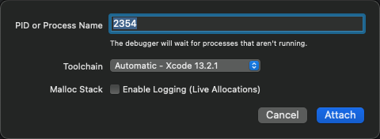

# XinaA15自带支持所有进程可调试

XinaA15开启越狱期间，有个日志提示：

```bash
签名debugserver
```
  * 

估计就是指的是：

* 给debugserver重签名，使得其支持：所有进程可调试

得到我们要的效果：

XinaA15越狱后，任何进程均可调试。

## 举例

### `设置`=`Preferences`

iOS内置app：`设置`=`Preferences`

* 已注入
  * 
    * 进程PID是`2354`

Xcode中去通过PID`2354`去调试Preferences：



即可顺利调试Preferences：


### `debugserver`

`XinaA15`中的`debugserver`的进程：

* debugserver：显示已被`(注入)(P)`
  * 
* 点击弹框可以查看到
  * 已注入了库：`xxx/procursus/usr/lib/TweakInject.dylib`
    * 
* 去查看`ENT`=`entitlement`=`权限`，发现已经有我们希望的值了
  * `task_for_pid-allow`
    * 
  * `get-task-allow`
    * 

### `akd`

`XinaA15`中的`akd`的进程：

* 去查看`ENT`=`entitlement`=`权限`，发现已经有我们希望的值了
  * `task_for_pid-allow` + `proc_info-allow`
    * 
  * `get-task-allow`
    * 
  * `platform-application`
    * 
